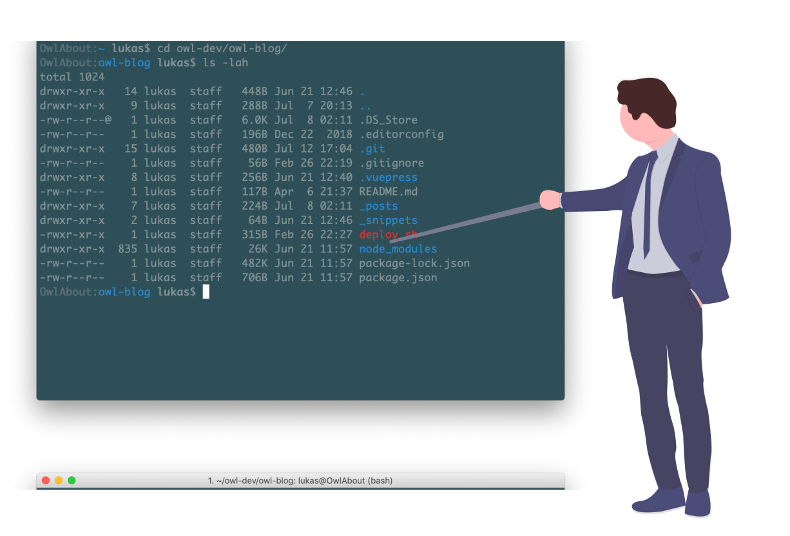

:::hero #2779b0

:::

# Command Line Basics

> learn enough command line to be dangerous

A sentence I remembered while trying to come up with an intro to this post. Because the question is, with all the beautiful graphical interfaces, why on earth would anyone want to learn using the command line?

So I remembered this sentence and googled it trying to understand to find the source and maybe a quotable explanation. This is what came up:

>"Enough to be dangerous" means that you know enough to make big (potentially dangerous) decisions or actions, but don't have enough experience to know when such activity is advised and when it should be avoided.
[1](https://ell.stackexchange.com/questions/124321/what-is-the-meaning-of-the-phrase-to-be-dangerous)

This seemed curious. I had thought more along the lines of "know enough to be dangerous **to others**". E.g. having these amazing skills, no one can stop me hacking them.

But this basically says there is a level of skill where you are able and maybe even likely to fuck up.

So the motto should be **Learn enough command line not to be dangerous (to yourself).**

## Why?

The question remains: Why bother to learn the CLI? For me there are a bunch of reasons.

1. Sometimes there is no way around it. Some tools and programs do not have a graphical interface and most servers definitely don't have them.
2. It's more efficient once you get used to it. This might not be the case in the beginning.
3. It looks cool, especially when surrounded by the right people. Your brother the lawyer might be very impressed with all that complex computer stuff.
4. It's easier than you'd expect.

## Goals

So then, what are the goals? Number one is trying not to fuck up your system.
Second, learn some basic commands to navigate the command line.
And last but not least, know where to find more information.

## Steps

Endangering yourself might happen faster than you think. And there are some basic rules, which can help prevent it.

**Rule 1: Do not [copy and paste][example]**

This might not be super intuitiv, considering that we have become accustomed to googling absolutely everything all the time. Especially with command line, where you will never be able to remember all the commands and options anyway, it seems like the path of least resistance. If you have already found it, why not just copy and paste?

The obvious danger is not understanding the code you copy. So rule #2 is more rational.

**Rule 2: Understand the code you execute**

Do not execute code you don't understand. Especially not with sudo/administrator permissions. Most of the code you come accross will probably be perfectly safe. But you never know, so don' trust people on the interwebz.

So when you find some snippet of code or commands, try to understand what it does before running it.

If there are commands that are new to you, learn about them beforehand. For example using [explainshell.com](https://explainshell.com/), [man pages](https://en.wikipedia.org/wiki/Man_page) or [tldr](https://github.com/tldr-pages/tldr).

Back to rule #1. Now you understood the code, why not just copy/paste it? The reason is basically [unicode](https://en.wikipedia.org/wiki/Unicode). More specifically, the code might not be what it seems. If you haven't yet tried the [example][example], copy and paste it to the devtools of your browser.

```js
rеturn=([f])=>{eval(unescape(escape(f).replace(/u.{8}/g,'')))}

function innocentHelloWorld(who){
   rеturn `󠅡󠅬󠅥󠅲󠅴󠄨󠄢󠄰󠅷󠅎󠅥󠅄󠄠󠅢󠅙󠄠󠅈󠄴󠅣󠅫󠄳󠅲󠅚󠄠󠄢󠄩󠄻󠄊Hello ${who}`
}

innocentHelloWorld("world")
```

Surprised? I was. I still haven't fully figured out what's going on there. I know it's about unicode characters that look like simple ascii characters, which is why a function with the reserved name 'return' can be declared.

[example]:https://twitter.com/SylvainPV/status/1147106980542242816

**Rule 3: make backups**

Even if you do (or think you do) understand the code you're running. Something might go wrong. So just in case, make backups beforehand. E.g. of files you are changing. Or better yet, just have backups of your whole system.

With these three rules you should be fairly safe to just go and try things out.

## Commands

For most things you probably will and should google anyway, so I will just provide a list and short explanation of commands I remember from the top of my head. (Which means I use them pretty often.)

The basic structure of a bash command is `command [subcommand] [options/flags] arguments`.

Things surrounded with brackets are usually optional.
Most commands provide information to help you, when passed a `--help` flag

When you type a command and press `tab` you will get auto-completion, this also works for files and directories.

Some commands open a terminal-based editor or pager to show text files.
There are different ones, most widely availabe are [less](https://en.wikipedia.org/wiki/Less_(Unix)#Usage), vi and nano.

When I first opened one, I did not know how to close it again.
Less is closed by typing `q`.
Vi is closed by typing `:q` after another.
Nano is closed by pressing `ctrl + x`

Sometimes you also just

```bash
history # shows you the last commands you entered
grep [filter] # filters the input by a filter
| # < is called pipe and allows you to give the output of a command as inuput to another command
history | grep rsync # search through the history of commands for rsync
# this is very useful when you don't remember the exact syntax of a command you already used
man # open the manual for a command
man ls # close by pressing 'q'

ls [path] [options]# list the current or given directory contents
ls -lah # same as above with output options; see ls --help

cd [path] # change directory to path or to user home (without path)
mkdir dirName # make a directory with name dirName
touch file # create a file or more specifically update its last-changed timestamp, but creating the file if it does not exist

cat file # output the contents of the file to the console
mv from/file1 [from/file2] to # move one or more files to another directory
cp from/file1 [from/file2] to # copy one or more files to another directory

sudo command # run command with administrator rights, usually asks for password
# be careful using this

# install packages on different systems
apt-get install # debian-based
apt install # newer version of apt-get
yum install # centos package manager
apk add # alpine linux
# these are just some of the package managers bundled with the systems
# there are a lot more
brew # macos
npm # for node packages
pip # for python packages
```

Some of these can be annoying to type out all the time. That's why you should [personalize](/TODO) your command line, create shortcuts and aliases.
