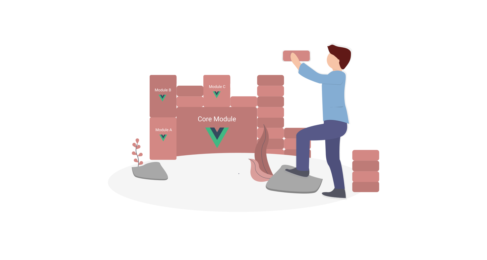
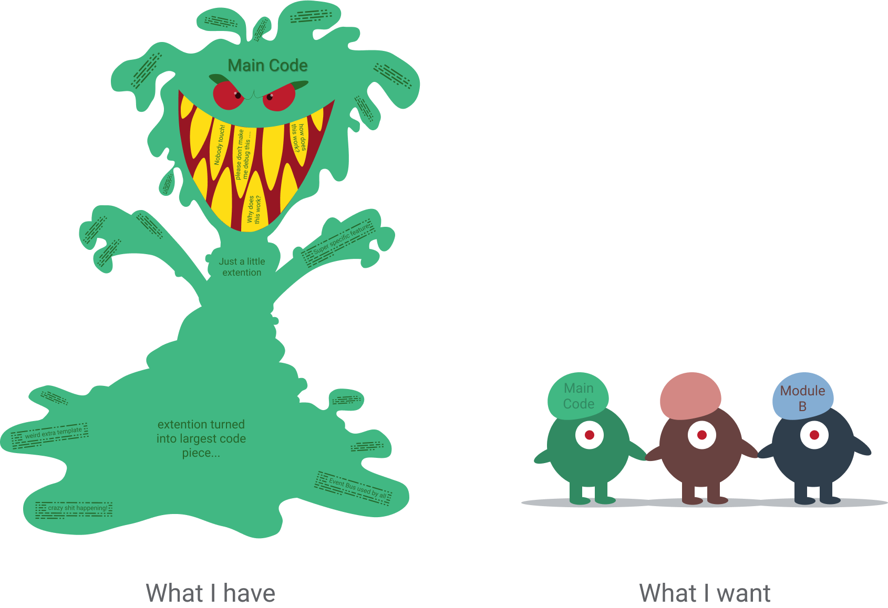
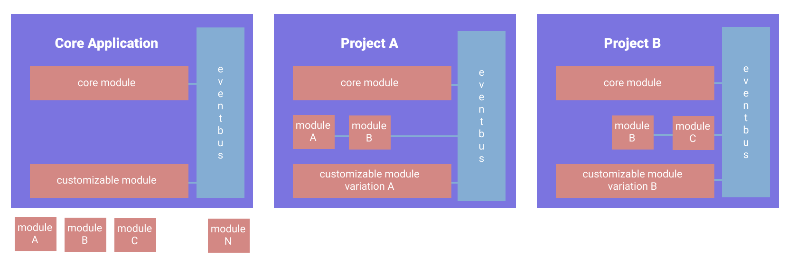

:::hero #84ADD3

:::

# Building an extendable Vue App

:::sticky 

:::

So, we had the situation, that we were building an application with Vuejs, which we were using for various projects. Anyone who has built an application for mulitple use-cases will at some point have realized, that there usually isn't a one solution that fits all. Instead you start adding feature after feature, many of which end up only being used in one single project. The application thus turns into an untameable monster, shipping enormous amounts of code for extremely simple tasks. 


## Goal

To goal was to reduce the monster itself to a cute and fluffy size and supply it with some extra gadgets for handling more complex or unique tasks. The endstate needed to fullfill these requirements: 

- The core project has some core components and functionalities that need to **always** be included
- Some modules need to be included **only** if specified in that project
- Some components, that belong th the core project can be customized or replaced in some projects, so those components must act as a default in case that component isn't specified elsewhere.
- All components and modules need be be able to communicate with each other via a global event-bus, that is included in the core project. 

This is the general setup I came up with. 



### Customizable Modules
"Customizable Module" is a module, that is always included in the core project. In Project B however we might want to replace that module with a customized version. It might have a different layout or some extra functionality which is not compatible with the original functionality.

### Plugins: Module A,B,C ... 
Modules A,B and C are plug-ins. They can be added, they can be left out, and both will work just fine. 

To simplefy the monster, let's just say that the template of our App.vue looks like this: 

```html
<template>
  <div class="core-application">
    <h1>Core Application</h1>
    <div class="container">
      <CoreModule />
      <div class="modlues">
        <ModuleA/>
        <ModuleB/>
        <ModuleC/>
      </div>
      <CustomizeableModule />
    </div>
  </div>
</template>
```
Each of the Modules used are simple Vue components that are imported and registered in the script tag of the App.vue. Our goal is now to move ModuleA, ModuleB and ModuleC to extra Node.js modules outside of our project and only import them, if specified in the configuration of our project. We also want to import a DefaultComponent as our Customizeable module unless a different one is specified in the configuration of our project. 

Let's do it. 

:::tip
########TODO
:::

## Import module only if specified in config.js
:::sticky configuration for project A
```js
// config.js for project A
import { ModuleA } from 'module-a';
import { ModuleB } from 'module-b';

export default {
  ModuleA,
  ModuleB
}
```
```html
<!-- App.vue -->
<template>
  <ModuleA v-if="hasModuleA()" />
</template>
<script>
import config from "../../config.js";
export default {
  components: {
    ModuleA: config.ModuleA || {},
    ModuleB: config.ModuleB || {},
    CoreModule,
    ...
  },
  methods: {
    hasModuleA() {
      return config.ModuleA;
    }
  }
}
</script>
```
:::

We now have an app that does exactly what it did before, except that the module A part of the code was moved to somewhere else. Now we need to change our app so that it only imports module A if specified in our configuration file. 
First we need a configuration file, that will handle all of our imports from modules for us. This file is project specific. So here we will import any and all modules that are not part of the core project and export them again.

This is our config.js file if we want to import module A:
```js
// config.js for project A
import { ModuleA } from 'module-a';

export default {
  ModuleA,
}
```
Now we can go through our core project and make sure that, at any point where moduleA is imported, it will only be imported from our config.js. 
In our case this would be directly in our App.vue. So let's throw out the import of the Module A component and import our config.js instead. Now we just register the component via our config.js.

```js
// script-tag of App.vue
import config from "../../config.js";
export default {
  components: {
    ModuleA: config.ModuleA || {},
    CoreModule,
    ...
  },
}
```
Now if we exclude Module A from our config.js it will be completly left out of the build. The template, however, will still try to render a component which it now cannot find. Therefore, let's make sure we know the component is there before we try to render it. V-if will help us with that. 

```html
<template>
  ...
  <ModuleA v-if="hasModuleA()" />
  ...
</template>
<script>
export default {
  ...
  methods: {
    hasModuleA() {
      return config.ModuleA;
    }
  }
}
</script>
```
There. Now for each project we can choose to include module A or not. 

## Customize or replace a component

:::sticky customize a core-component in project A
```html
<!-- App.vue -->
<script>
import config from "../../config.js";
import DefaultCustomComponent from "./DefaultCustomComponent.vue";
export default {
  components: {
    ModuleA: config.ModuleA || {},
    DefaultCustomComponent: config.DefaultCustomComponent || DefaultCustomComponent,
    CoreModule,
    ...
  },
}
</script>
```
```js
// config.js for project A
import { ModuleA } from 'module-a';
import { CustomModuleX as DefaultCustomizeableModule } from 'module-a';

export default {
  ModuleA,
  DefaultCustomizeableModule
}
```
:::

We still have a module that we would like to customize in some of our components. For example: say we have a status bar in all of our projects. Some general functionality might be the same in every project, but certain projects might want to expand that functionality to include some extra stuff. 

Since our customizeable module has some functionality, that we want included we can't just replace the component. Because then we'd have to duplicate on the functions that we want to keep. And well, code duplications seems to be something everyone wants to avoid. 
So instead, we'll use the functionalities as a mixin. Just move the template of the component to a default component which inherits all the functionality from the base component. 

```html
<!-- DefaultCustomComponent -->
<template>
  default template of the custom module
</template>
<script>
import baseCustomModule from "./baseCustomModule.vue";
export default {
  mixins: [baseCustomModlule]
}
</script>
```

Now we have a component, that we can easily replace without having to duplicate the core functionalities of the core component. Similar to the component registration of Module A, we will check to see if our customized component is specified in our config.js and register that one. If not, we register the default component, that is imported normally. 

```html
<!-- App.vue -->
<script>
import config from "../../config.js";
import DefaultCustomComponent from "./DefaultCustomComponent.vue";
export default {
  components: {
    ModuleA: config.ModuleA || {},
    DefaultCustomComponent: config.DefaultCustomComponent || DefaultCustomComponent,
    CoreModule,
    ...
  },
}
</script>
```
We don't need to change anything in the template of our App.vue, because it will always have a component to render of the name "DefaultCustomComponent". It just might be a different one depending on our config.js. Ah yes, let's not forget to import our Custom Component in our config.js:

```js
// config.js for project A
import { ModuleA } from 'module-a';
import { CustomModuleX as DefaultCustomizeableModule } from 'module-a';

export default {
  ModuleA,
  DefaultCustomizeableModule
}
```


