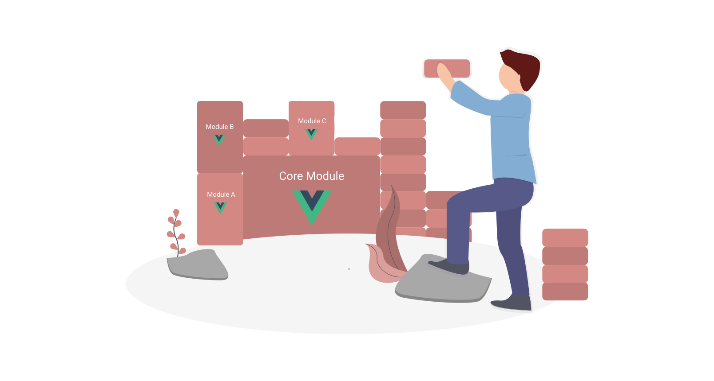

:::hero #84ADD3

:::

# Building an extendable Vue App

:::sticky 

:::

Imagine you start building a little web-app that is supposed to do exactly one thing. But then the next project for a different customer comes along which is very similar except that it needs to be able to do another thing. And maybe even a third? So you start adding on to your little application. And then you realize, that you can use this little application for an entirely different customer project, by just adding on another little feature. And at some point down the road you take a step back, and (feeling a bit like Dr. Frankenstein) you realize you've created a monster, that you cannot control. 

Sound slightly familiar? It sure does to me. I think anyone who has built an application and adapted it for multiple projects will, at some point, have realized, that there usually isn't a *one solution that fits all*. Instead you start adding feature after feature, many of which end up only being used in one single project. In effect you're shipping enormous amounts of code for extremely simple tasks. 


## Goal

I currently have a monster of a Vuejs project. I decided it was time to tame the asshole, reduce him to a cute and fluffy version and supply him with some extra gadgets for handling more complex or unique tasks. The endstate needed to fulfill these requirements: 

- The core project has some core components and functionalities that need to **always** be included
- Some modules need to be included **only** if specified in that project
- Some components, that belong to the core project can be customized or replaced in some projects, so those components must act as a default in case that component isn't specified elsewhere.
- All components and modules need to be able to communicate with each other via a global event-bus, that is included in the core project. 

This is the general setup I came up with. 


### Customizable Modules
"Customizable Module" is a module, that is always included in the core project. In Project B however we might want to replace that module with a customized version. It might have a different layout or some extra functionality that is not compatible with the original functionality.

### Plugins: Module A,B,C ... 
Modules A, B and C are plug-ins. They can be added, they can be left out, and both will work just fine. 

To simplefy the monster, let's just say that our App.vue looks like this: 

```html
<template>
  <div class="core-application">
    <h1>Core Application</h1>
    <div class="container">
      <CoreModule />
      <div class="modlues">
        <ModuleA/>
        <ModuleB/>
      </div>
      <CustomizableModule />
    </div>
  </div>
</template>

<script>
  import CoreModule from "./CoreModule.vue";
  import ModuleA from "./ModuleA.vue";
  import ModuleB from "./ModuleB.vue";
  import CustomizableModule from "./CustomizableModule.vue";
  export default {
    components: {
      CoreModule,
      ModuleA,
      ModuleB,
      CustomizableModule
    }
  }
</script>
```
Each of the modules used are simple Vue components that are imported and registered in the script tag of the App.vue. Our goal is now to move module A, module B and module C to extra Node.js modules outside of our project and only import them, if specified in the configuration of our project. We also want to import a default-component as our customizable module unless a different one is specified in the configuration of our project. 

Let's do it. 

Let's start with just one module. How about (great surprise) module A. 
The first thing we want to do ist move everything that belongs to that module into a separate folder and turn it into an isolated node module. We'll make sure to link the module to our project during development so as not to disrupt our flow too much. If you want to see how to create and Node.js modules check out [this post](/posts/2020/05/organizing-nodejs-modules).

We are just going to assume that the code of module A has already been moved to an extra node-module. We now need to adapt our application to only include module A if it is specified in a configuration file. 

## Import module only if specified in config.js
:::sticky configuration for project A
```js
// config.js for project A
import { ModuleA } from 'module-a';
import { ModuleB } from 'module-b';

export default {
  ModuleA,
  ModuleB
}
```
```html
<!-- App.vue -->
<template>
  <ModuleA v-if="hasModuleA()" />
</template>
<script>
import config from "../../config.js";
export default {
  components: {
    ModuleA: config.ModuleA || {},
    ModuleB: config.ModuleB || {},
    CoreModule,
    ...
  },
  methods: {
    hasModuleA() {
      return config.ModuleA !== undefined;
    }
  }
}
</script>
```
:::

First we need a configuration file, that will handle all of our imports from modules for us. This file is project-specific. So here we will import any and all modules that are not part of the core project and export them again.

This is our config.js file if we want to import module A:
```js
// config.js for project A
import { ModuleA } from 'module-a';

export default {
  ModuleA,
}
```
Now we can go through our core project and make sure that, at any point where module A is imported, it will only be imported from our config.js. 
In our case this would be directly in our App.vue. So let's throw out the import of the module A component and import our config.js instead and register the component via our config.js.

```js
// script-tag of App.vue
import config from "../../config.js";
export default {
  components: {
    ModuleA: config.ModuleA || {},
    CoreModule,
    ...
  },
}
```
Now if we exclude module A from our config.js it will be completely left out of the build. The template, however, will still try to render a component which it now cannot find. Therefore, let's make sure we know the component is there before we try to render it. V-if will help us with that. 

```html
<template>
  ...
  <ModuleA v-if="hasModuleA()" />
  ...
</template>
<script>
export default {
  ...
  methods: {
    hasModuleA() {
      return config.ModuleA !== undefined;
    }
  }
}
</script>
```
There. Now for each project we can choose to include module A or not. 

## Customize or replace a component

:::sticky customize a core-component in project A
```html
<!-- App.vue -->
<script>
import config from "../../config.js";
import DefaultCustomComponent from "./DefaultCustomComponent.vue";
export default {
  components: {
    ModuleA: config.ModuleA || {},
    DefaultCustomComponent: config.DefaultCustomComponent || DefaultCustomComponent,
    CoreModule,
    ...
  },
}
</script>
```
```js
// config.js for project A
import { ModuleA } from 'module-a';
import { CustomModuleX as DefaultCustomizableModule } from 'module-a';

export default {
  ModuleA,
  DefaultCustomizableModule
}
```
:::

We still have a module that we would like to customize in some of our components. For example: say we have a status bar in all of our projects. Some general functionality might be the same in every project, but certain projects might want to expand that functionality to include some extra stuff. 

Since our customizable module has some functionality that we want to be included we can't just replace the component. Because then we'd have to duplicate the functions that we want to keep. And we all know code [duplications are evil](https://en.wikipedia.org/wiki/Don%27t_repeat_yourself). 
Instead, we'll use the functionalities as a mixin. Just move the template of the component to a default component that inherits all the functionality from the base component. 

```html
<!-- DefaultCustomComponent -->
<template>
  default template of the custom module
</template>
<script>
import BaseCustomModule from "./BaseCustomModule.vue";
export default {
  mixins: [BaseCustomModlule]
}
</script>
```

Now we have a component, that we can easily replace without having to duplicate the core functionalities of the core component. Similar to the component registration of Module A, we will check to see if our customized component is specified in our config.js and register that one. If not, we register the default component, that is imported normally. 

```html
<!-- App.vue -->
<script>
import config from "../../config.js";
import DefaultCustomComponent from "./DefaultCustomComponent.vue";
export default {
  components: {
    ModuleA: config.ModuleA || {},
    DefaultCustomComponent: config.DefaultCustomComponent || DefaultCustomComponent,
    CoreModule,
    ...
  },
}
</script>
```
We don't need to change anything in the template of our App.vue, because it will always have a component to render of the name "DefaultCustomComponent". It just might be a different one depending on our config.js. Ah yes, let's not forget to import our custom component in our config.js:

```js
// config.js for project A
import { ModuleA } from 'module-a';
import { CustomModuleX as DefaultCustomizableModule } from 'module-a';

export default {
  ModuleA,
  DefaultCustomizableModule
}
```

The CustomModuleX that is being imported here from module-a also uses the same mixin as our default custom component. This means that it needs to import the BaseCustomComponent from the core project. 

:::tip
use this syntax if you want to import a component under a different name than it was  exported in the Node.js module:

`import { CustomModuleX as DefaultCustomizableModule } from 'module-a';` 
:::

## Communicating via Event-Bus
:::sticky import the eventbus from the core project 
```html
<!-- module A component -->
<script>
  import { EventBus } from "@/src/eventBus.js"
</script>
```
:::

The original monster uses an event-bus for communication between different vue-components, that cannot simply be solved with properties. I originally figured, that this would be the biggist issue of moving components off to node modules. But node modules are not necessaril libraries.  A library stands for itself and can be used independently. An extension on the other hand is used only in combination with the core project. 

Since all of our modules are very project-specific extensions, the event-bus actually does not pose a problem at all. There is no reason why the modules cannot simply import the event-bus from the core project and use it normally. Tada: intermodular communication!

:::tip
**Webpack lets you define aliases** 

It might be helpful to have an alias for your root-directory (in this case '@') when importing cross-module components. Otherwise, if your module moves to a different place in your code, everything might go to shit and you'd spend forever trying to figure out why it woult build.
:::

And that's it. Those are the basic steps we need to go through to tame our asshole of a monster and make it cute and fluffy again while still being able to customize it for any project. 
